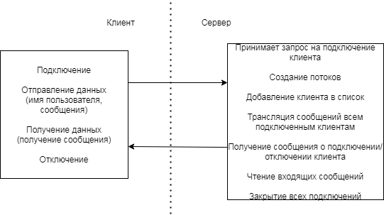
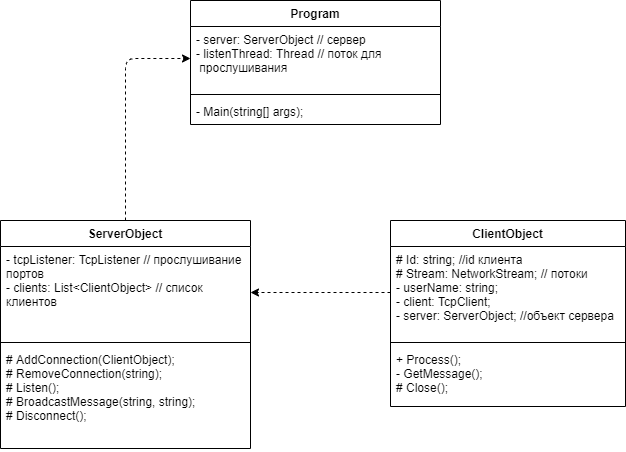

# LAB2

# Контрольные вопросы

# 1.    Перечислите основные разновидности клиент-серверной архитектуры.

Веб-приложения, выполняющиеся в Интернете или внутренних сетях организаций; настольные приложения для операционной системы Microsoft Windows®, выполняющие доступ к сетевым сервисам данных; приложения, выполняющие доступ к удаленным хранилищам данных (такие как программы чтения электронной почты, FTP-клиенты и средства доступа к базам данных); инструменты и утилиты для работы с удаленными системами (такие как средства управления системой и средства мониторинга сети).
Системы клиент-очередь-клиент.
Одноранговые (Peer-to-Peer, P2P) приложения.
Серверы приложений. Специализированный архитектурный стиль, при котором приложения и сервисы размещаются и выполняются на сервере, и тонкий клиент выполняет доступ к ним через браузер или специальное установленное на клиенте ПО.

# 2.    Опишите стек протоколов используемых при организации клиент-серверной архитектуры.

Наиболее известные сетевые модели:
1. модель OSI – теоретическая, эталонная модель, описанная в международных стандартах;
2. модель DOD (Модель TCP/IP) – практически использующаяся модель, принятая для работы в Интернете.
3. модель AppleTalk – модель работы сетей с оборудованием фирмы Apple;
4. модель SPX/IPX – модель стека SPX/IPX (семейство протоколов для локальных вычислительных сетей).

# 3. Какие компоненты платформы .NET используются для прослушивания входящих подключений на определённом порте?

Класс TcpListener прослушивает входящие подключения по определенному порту.
При использовании сокетов:
listenSocket.Listen(10);
Метод Listen вызывается только после метода Bind. В качестве параметра он принимает количество входящих подключений, которые могут быть поставлены в очередь сокета.

# 4.    Что такое потоки в программировании?

Потоки – последовательность инструкций, которая выполняется параллельно с другими потоками. В одном процессе может быть несколько потоков, отвечающих за определенные функции для ускорения работы приложения.

# 5.    Как реализуются потоки в языке C#?

Для получения и отправки данных с помощью сокетов в .NET используется класс потоков NetworkStream из пространства имен System.Net.Sockets. Он наследуется от базового класса Stream. В то же время он отличается от других классов потоков тем, что он не является буферизованным и не поддерживает перемещение в произвольную позицию с помощью метода Seek.
Также при записи в поток не надо использовать метод Flush для сброса в поток всех данных.
Основные методы и свойства NetworkStream:
•    Свойство DataAvailable: возвращает значение true, если в потоке есть данные. Если их нет, возвращается false.
•    Метод Read(byte[] buffer, int offset, int length);: считывает данные из потока в массив buffer, начиная со смещения offset. Количество считываемых из потока данных указывается в параметре length
•    Метод Write(byte[] buffer, int offset, int length): отправляет данные из массива buffer, начиная со смещения offset, в поток. Количество отправляемых из массива данных указывается в параметре length
•    Метод Close(): закрывает поток

