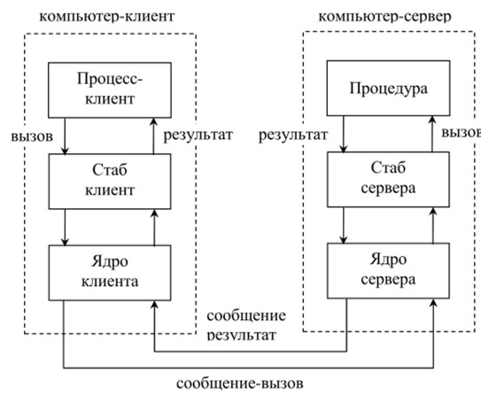

# LAB 4

# Контрольные вопросы

# 1. Опишите основные принципы архитектуры приложений, основанной на удалённом вызове процедур? 

Суть вызова удалённых процедур (Remote Procedure Call- RPC) заключается в применении механизма вызова процедур (подпрограмм, функций) для построения распределённых систем. Данный механизм является реализацией принципа модульного программирования и изначально широко использовался только для вызова локальных процедур, т.е. процедур, выполняемых на том же компьютере, что и вызывающая программа. 

# 2.	Опишите механизм работы удалённой процедуры?  

# 3. Опишите структуру протокола XML-RPC. 

Запросы XML-RPC представляют собой комбинацию содержимого XML и заголовков HTTP. Содержимое XML использует структуру типизации данных для передачи параметров и содержит дополнительную информацию, определяющую, какая процедура вызывается, а заголовки HTTP предоставляют оболочку для передачи запроса через Интернет.

Ответы очень похожи на запросы, с несколькими дополнительными поворотами. Если ответ успешен — процедура была найдена, выполнена правильно и вернула результаты — тогда ответ XML-RPC будет очень похож на запрос, за исключением того, что элемент methodCall заменяется элементом methodResponse, а элемент methodName отсутствует.

# 4. Как реализуется механизм удалённого вызова процедур в платформе .NET?

Сначала нужно написать сервер с интерфейсом процедур, которые будут доступны для удаленного вызова. Далее нужно написать клиент, который будет содержать объект взаимодействия с сервером и удаленными процедурами. В объект заносятся необходимые параметры и передаются на сторону сервера, где происходит процесс их обработки. Затем Сервер возвращает клиенту сформированный результат.